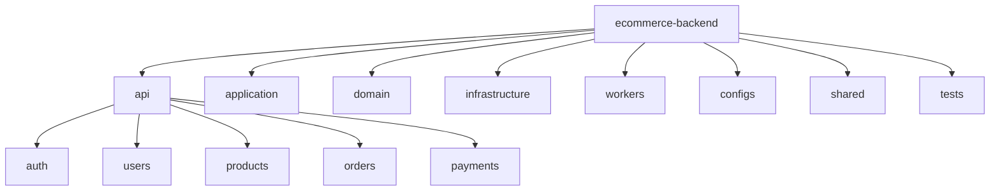

```
ecommerce-backend/
│
├── app/
│   │
│   ├── api/
│   │   └── v1/
│   │       ├── auth/
│   │       ├── users/
│   │       ├── products/
│   │       ├── categories/
│   │       ├── cart/
│   │       ├── wishlist/
│   │       ├── orders/
│   │       ├── payments/
│   │       ├── reviews/
│   │       ├── interactions/
│   │       ├── search/
│   │       ├── recommendations/
│   │       └── admin/
│   │
│   ├── application/
│   │   ├── auth/
│   │   ├── users/
│   │   ├── products/
│   │   ├── cart/
│   │   ├── orders/
│   │   ├── payments/
│   │   ├── interactions/
│   │   ├── search/
│   │   └── recommendations/
│   │
│   ├── domain/
│   │   ├── user/
│   │   ├── product/
│   │   ├── category/
│   │   ├── cart/
│   │   ├── order/
│   │   ├── payment/
│   │   ├── review/
│   │   └── interaction/
│   │
│   ├── infrastructure/
│   │   ├── database/
│   │   ├── cache/
│   │   ├── messaging/
│   │   ├── ai_client/
│   │   ├── search/
│   │   ├── storage/
│   │   ├── email/
│   │   └── payment/
│   │
│   ├── workers/
│   │   ├── notifications/
│   │   ├── analytics/
│   │   └── event_processing/
│   │
│   ├── core/
│   │   ├── config.py
│   │   ├── security.py
│   │   ├── logging.py
│   │   └── exceptions.py
│   │
│   └── main.py
│
├── migrations/
│
├── tests/
│   ├── unit/
│   ├── integration/
│   └── api/
│
├── Dockerfile
├── docker-compose.yml
├── pyproject.toml
└── README.md
```




```
✔ FastAPI
✔ SQLAlchemy
✔ PostgreSQL
✔ Alembic
✔ JWT Authentication
✔ Role Based Access
✔ Pydantic
✔ Dependency Injection
✔ Validation
✔ Repository Pattern
✔ Service Layer
✔ Unit of Work
✔ Docker
✔ Redis
✔ Background Tasks
✔ Celery/RQ
✔ Kafka Producer
✔ Kafka Consumer
✔ Logging
✔ Exception Handling
✔ Configuration Management
✔ File Upload
✔ Email
✔ Pagination
✔ Filtering
✔ Search
✔ Testing
✔ CI/CD
```


Phase 1 — Foundation

FastAPI
Configuration
PostgreSQL
SQLAlchemy
Alembic
Project structure

Phase 2 — Core ecommerce

User
Role
Product
Order
OrderItem

Phase 3 — Security

Registration
Login
JWT
Password hashing
RBAC

Phase 4 — APIs

User APIs
Product APIs
Order APIs
Interaction APIs
Dashboard APIs

Phase 5 — Backend engineering

Repository layer
Service layer
Validation
Exception handling
Middleware
Pagination
Testing
Docker

Phase 6 — AI integration

Only after your AI platform is ready:

Backend
   ↓
AI Client
   ↓
Recommendation API
   ↓
AI Platform

Backend
   │
   │ get_recommendations(user_id)
   ▼
AI Client
   │
   │ HTTP/gRPC
   ▼
AI Recommendation Service
   │
   ├── ALS
   ├── Two-Tower
   ├── XGBoost
   ├── Hybrid
   └── future models


                       FRONTEND
                       │
                       │ REST/HTTP
                       ▼
              ┌─────────────────┐
              │ ECOMMERCE       │
              │ BACKEND         │
              │                 │
              │ Auth            │
              │ Users           │
              │ Products        │
              │ Orders          │
              │ Interactions    │
              │ Dashboard       │
              └────────┬────────┘
                       │
              ┌────────┴─────────┐
              │                  │
              ▼                  ▼
        PostgreSQL          AI PLATFORM
                              │
                    ┌─────────┴──────────┐
                    │                    │
                    ▼                    ▼
               ML Training         AI Inference
                    │                    │
                    └────────┬───────────┘
                             │
                             ▼
                     Recommendations


PHASE 0
Project initialization
        ↓
PHASE 1
FastAPI application foundation
        ↓
PHASE 2
Configuration management
        ↓
PHASE 3
PostgreSQL + SQLAlchemy
        ↓
PHASE 4
Alembic migrations
        ↓
PHASE 5
User domain
        ↓
PHASE 6
Repository + Unit of Work
        ↓
PHASE 7
User service/use case
        ↓
PHASE 8
User APIs
        ↓
PHASE 9
Authentication
        ↓
PHASE 10
Authorization/RBAC
        ↓
PHASE 11
Product + Category
        ↓
PHASE 12
Cart + Wishlist
        ↓
PHASE 13
Interactions ← VERY IMPORTANT FOR AI
        ↓
PHASE 14
Orders + Inventory
        ↓
PHASE 15
Redis
        ↓
PHASE 16
Kafka events
        ↓
PHASE 17
Background workers
        ↓
PHASE 18
Search integration
        ↓
PHASE 19
AI Platform client
        ↓
PHASE 20
Recommendation APIs
        ↓
PHASE 21
Testing
        ↓
PHASE 22
Docker
        ↓
PHASE 23
Observability
        ↓
PHASE 24
CI/CD
        ↓
PHASE 25
SaaS / multi-tenancy


# Tests architecture
```
ecommerce-backend/
│
├── app/
│   ├── api/
│   │   └── v1/
│   │       ├── auth/
│   │       ├── users/
│   │       ├── products/
│   │       ├── orders/
│   │       ├── cart/
│   │       ├── payments/
│   │       ├── reviews/
│   │       ├── search/
│   │       └── recommendation/
│   │
│   ├── application/
│   │   ├── auth/
│   │   ├── users/
│   │   ├── products/
│   │   ├── orders/
│   │   ├── cart/
│   │   ├── payments/
│   │   └── recommendation/
│   │
│   ├── domain/
│   │   ├── user/
│   │   ├── product/
│   │   ├── order/
│   │   ├── inventory/
│   │   └── recommendation/
│   │
│   └── infrastructure/
│       ├── database/
│       ├── cache/
│       ├── messaging/
│       ├── ai_platform/
│       └── search_engine/
│
├── tests/
│   │
│   ├── unit/
│   │   │
│   │   ├── domain/
│   │   │   ├── user/
│   │   │   │   ├── test_user.py
│   │   │   │   └── test_user_rules.py
│   │   │   │
│   │   │   ├── product/
│   │   │   ├── order/
│   │   │   └── inventory/
│   │   │
│   │   └── application/
│   │       ├── auth/
│   │       ├── users/
│   │       ├── products/
│   │       ├── orders/
│   │       └── recommendation/
│   │
│   ├── integration/
│   │   │
│   │   ├── database/
│   │   │   ├── test_connection.py
│   │   │   └── test_migrations.py
│   │   │
│   │   ├── repositories/
│   │   │   ├── test_user_repository.py
│   │   │   ├── test_product_repository.py
│   │   │   ├── test_order_repository.py
│   │   │   └── test_interaction_repository.py
│   │   │
│   │   ├── cache/
│   │   │   └── test_redis.py
│   │   │
│   │   ├── messaging/
│   │   │   ├── test_kafka_producer.py
│   │   │   └── test_kafka_consumer.py
│   │   │
│   │   ├── ai_platform/
│   │   │   └── test_ai_client.py
│   │   │
│   │   └── search/
│   │       └── test_search_engine.py
│   │
│   ├── api/
│   │   │
│   │   ├── auth/
│   │   │   ├── test_register.py
│   │   │   ├── test_login.py
│   │   │   └── test_refresh_token.py
│   │   │
│   │   ├── users/
│   │   │   ├── test_create_user.py
│   │   │   ├── test_get_user.py
│   │   │   └── test_update_user.py
│   │   │
│   │   ├── products/
│   │   ├── orders/
│   │   ├── cart/
│   │   └── recommendation/
│   │
│   ├── contract/
│   │   ├── test_ai_platform_contract.py
│   │   ├── test_payment_gateway_contract.py
│   │   └── test_search_contract.py
│   │
│   ├── e2e/
│   │   ├── test_registration_flow.py
│   │   ├── test_login_flow.py
│   │   ├── test_purchase_flow.py
│   │   └── test_recommendation_flow.py
│   │
│   ├── fixtures/
│   │   ├── users.py
│   │   ├── products.py
│   │   ├── orders.py
│   │   └── recommendations.py
│   │
│   └── conftest.py
│
├── pyproject.toml
└── README.md

```


```
| Project feature | Backend concepts we learn            |
| --------------- | ------------------------------------ |
| Auth            | JWT, hashing, dependencies, security |
| Authorization   | RBAC, policies, dependency design    |
| Users           | CRUD, validation, transactions       |
| Products        | relational modeling, indexes         |
| Inventory       | concurrency, locking, transactions   |
| Cart            | state management, caching            |
| Orders          | transactions, UoW, idempotency       |
| Payments        | external APIs, webhooks, reliability |
| Notifications   | background workers                   |
| Events          | Kafka, event-driven architecture     |
| Search          | Elasticsearch/vector search          |
| Dashboard       | aggregation, pagination, caching     |
| AI              | service-to-service communication     |
| Production      | Docker, CI/CD, AWS                   |
| Observability   | logging, metrics, tracing            |
```